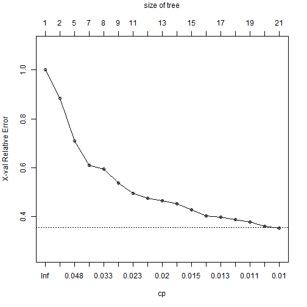

#1. Introduction

The project involves solving a *Classification Problem* (Predicting the Class based on some Independent Variables.)


We have been provided the data from accelerometers on the belt, forearm, arm, and dumbell of 6 participants. They were asked to perform barbell lifts correctly and incorrectly in 5 different ways. 

More information is available from the website here: <http://groupware.les.inf.puc-rio.br/har> (see the section on the Weight Lifting Exercise Dataset).

The problem is approached through the following the three steps: 

1.1 Pre-Processing of Data (Discussing the Approach I have taken.)

1.2 Learning the Clasification Hypothesis using the Training Data

1.3 Using the Learned Model for Predicting Classification for the Testing Data


#2. Pre-Processing of Data

We have first identified the variables which are present in the testing data and then removed all those variables from the training data as well which are not in the testing data, as the final prediction is to be done for the testing data.

Also there was a categorical variable named as *new_window* whihch takes values either *yes* or *no*, we have recoded them as *1* and *0* respectively.


#3. Learning the Clasification Hypothesis using the Training Data

We need to learn a Classification hypothesis using the training data. Several algorithms like Classification Tree, Random Forests, ADA Boosting etc. have been introduced in the lectures. We are making use of the Classification Tree Algorithm for this purpose. 

Learning a Classification Tree for the Training Data:


```r
#Reading Training and Test Data.
training<-read.csv("pml-training.csv",header=TRUE)
testing<-read.csv("pml-testing.csv",header=TRUE)

#Including the Necessary Library rpart
library(rpart)

#Fitting the Model
fit <- rpart(classe ~.,method="class", data=training)
```

```r
# Displaying the Model Results
printcp(fit)

# Visualizing Cross-Validation Results
plotcp(fit)  

# Detailed Summary of Splits
summary(fit) 
```

## Assessing the Performance of Model on the Training Data

##3.1. Confusion Matrix


```
## 
##    Cell Contents
## |-------------------------|
## |                   Count |
## |-------------------------|
## 
## Total Observations in Table:  19622 
## 
##                | Predicted_Class 
## Observed_Class |        A  |        B  |        C  |        D  |        E  | Row Total | 
## ---------------|-----------|-----------|-----------|-----------|-----------|-----------|
##              A |     4970  |      636  |      128  |      201  |      179  |     6114  | 
## ---------------|-----------|-----------|-----------|-----------|-----------|-----------|
##              B |      175  |     2336  |      243  |      279  |      398  |     3431  | 
## ---------------|-----------|-----------|-----------|-----------|-----------|-----------|
##              C |       59  |      244  |     2772  |      469  |      288  |     3832  | 
## ---------------|-----------|-----------|-----------|-----------|-----------|-----------|
##              D |      299  |      461  |      189  |     2120  |      424  |     3493  | 
## ---------------|-----------|-----------|-----------|-----------|-----------|-----------|
##              E |       77  |      120  |       90  |      147  |     2318  |     2752  | 
## ---------------|-----------|-----------|-----------|-----------|-----------|-----------|
##   Column Total |     5580  |     3797  |     3422  |     3216  |     3607  |    19622  | 
## ---------------|-----------|-----------|-----------|-----------|-----------|-----------|
## 
## 
```

##3.2 Visualizing Cross-Validation Results and Expected Out of Sample Error

Cross-Validation Results plot is as follows:

 

We use the **Percentage of Misclassification in Cross-Validation** as an estimate of expected out of sample error. The percentage of misclassification turns out to be 26.02%. So the model can be taken as of good adequacy.


#4. Using the Learned Model for Predicting Classification for the Testing Data

Now we make use of the developed classification model to predict the classes for the testing data. The testing data has 20 observations and we need to predict the class of each of the observations.

Using the learned model we obtain the probabilities for each observation belonging to each of the 5 classes viz. A, B, C, D and E. The class for which an observation has the maximum probability we classify that observation into that class.

We get the following table representing individual probabilities and the predicted classes for each of the observations in the testing data.:


```
##    Obs Prob.A.   Prob.B. Prob.C. Prob.D.  Prob.E. Predicted.Class
## 1    1 0.09884 0.5465116 0.00000 0.00000 0.354651               B
## 2    2 0.77892 0.1745574 0.01359 0.02676 0.006175               A
## 3    3 0.01396 0.5340314 0.22862 0.10122 0.122164               B
## 4    4 0.83483 0.0007508 0.00000 0.06156 0.102853               A
## 5    5 0.83483 0.0007508 0.00000 0.06156 0.102853               A
## 6    6 0.02394 0.0819473 0.11684 0.17769 0.599594               E
## 7    7 0.06650 0.1240409 0.03581 0.69693 0.076726               D
## 8    8 0.12406 0.5243596 0.07986 0.12657 0.145153               B
## 9    9 0.99366 0.0063371 0.00000 0.00000 0.000000               A
## 10  10 0.77892 0.1745574 0.01359 0.02676 0.006175               A
## 11  11 0.02394 0.5995943 0.08195 0.17769 0.116836               B
## 12  12 0.01396 0.2286213 0.53403 0.10122 0.122164               C
## 13  13 0.02394 0.5995943 0.08195 0.17769 0.116836               B
## 14  14 0.99366 0.0063371 0.00000 0.00000 0.000000               A
## 15  15 0.07636 0.1454545 0.10909 0.17818 0.490909               E
## 16  16 0.12406 0.1265696 0.52436 0.07986 0.145153               B
## 17  17 0.83483 0.0007508 0.00000 0.06156 0.102853               A
## 18  18 0.10744 0.4008264 0.01033 0.33058 0.150826               B
## 19  19 0.10744 0.4008264 0.01033 0.33058 0.150826               B
## 20  20 0.01396 0.5340314 0.22862 0.10122 0.122164               B
```

#5. Conclusion

The classification model learned using the training data works decently well for both training and testing sets indicating the adequacy of fitting strength and predictive strength of the model.

However other classification algorithms like Random Forest, ADA Boost etc. can also be utilized for the same problem.
